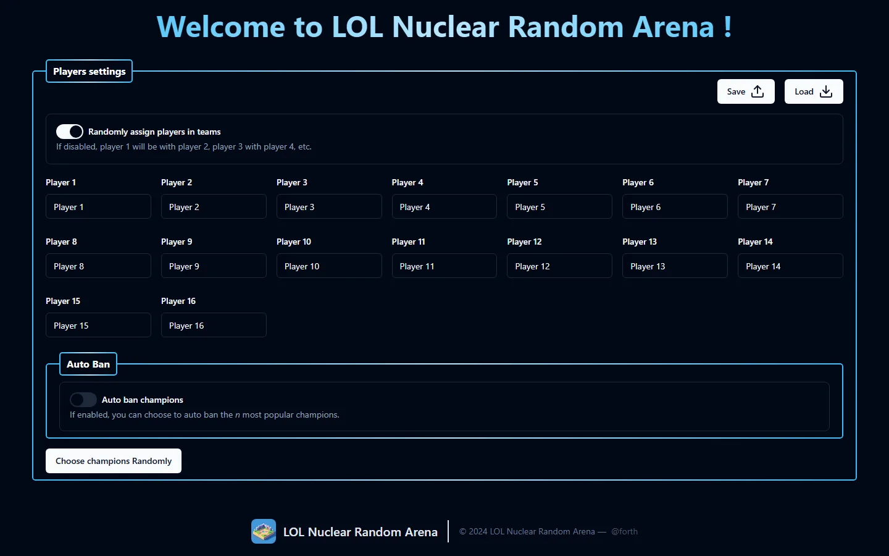
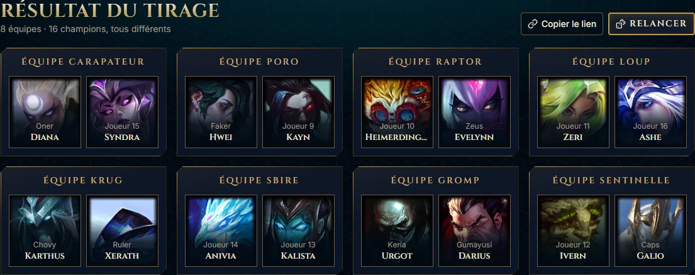

# ⚔️ LOL Nuclear Random Arena

 [](https://kit.svelte.dev/)   [](https://zod.dev/)

> Fini les débats interminables pour former les équipes du mode Arena de League of Legends : renseigne les joueurs présents, laisse le générateur tirer les équipes et les champions au hasard.

**🔗 Démo :** [lol-random-arena.vercel.app](https://lol-random-arena.vercel.app/)



## Fonctionnalités

- 🎲 **Répartition aléatoire** des joueurs en équipes de 2 (ou par ordre d'inscription si le mode aléatoire est désactivé)
- 🏆 **Génération aléatoire de champion** pour chaque joueur
- 🚫 **Ban automatique** des champions les plus joués ou les mieux gagnants, avec un curseur pour choisir combien en bannir
- 💾 **Sauvegarde/chargement** de la configuration des joueurs (noms, options) pour ne pas tout ressaisir à chaque partie
- ⚡ Résultat instantané, sans rechargement de page (SvelteKit + form actions)

## Résultat



## Stack technique

- [SvelteKit](https://kit.svelte.dev/)
- [TypeScript](https://www.typescriptlang.org/)
- [Tailwind CSS](https://tailwindcss.com/) + [shadcn-svelte](https://www.shadcn-svelte.com/)
- [Zod](https://zod.dev/) + [sveltekit-superforms](https://superforms.rocks/) — validation de formulaire côté client et serveur
- [bits-ui](https://www.bits-ui.com/) — primitives accessibles (switch, dialog, select...)

## Installation

Ce projet utilise [bun](https://bun.sh) comme gestionnaire de paquets.

```bash
# cloner le repo
git clone https://github.com/Forthtilliath/lol-random-arena.git
cd lol-random-arena

# installer les dépendances
bun install

# lancer le serveur de développement
bun run dev
```

### Scripts disponibles

| Commande        | Description                           |
| --------------- | -------------------------------------- |
| `bun run dev`    | Serveur de développement               |
| `bun run build`  | Build de production                    |
| `bun run preview`| Prévisualise le build de production    |
| `bun run check`  | Vérification des types (svelte-check)  |
| `bun run lint`   | Lint (Prettier + ESLint)               |
| `bun run format` | Formate le code (Prettier)             |

## Licence

Distribué sous licence [MIT](./LICENSE).
